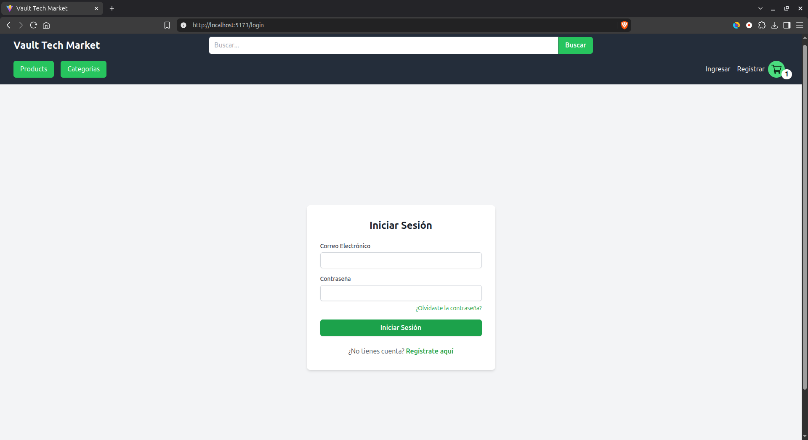
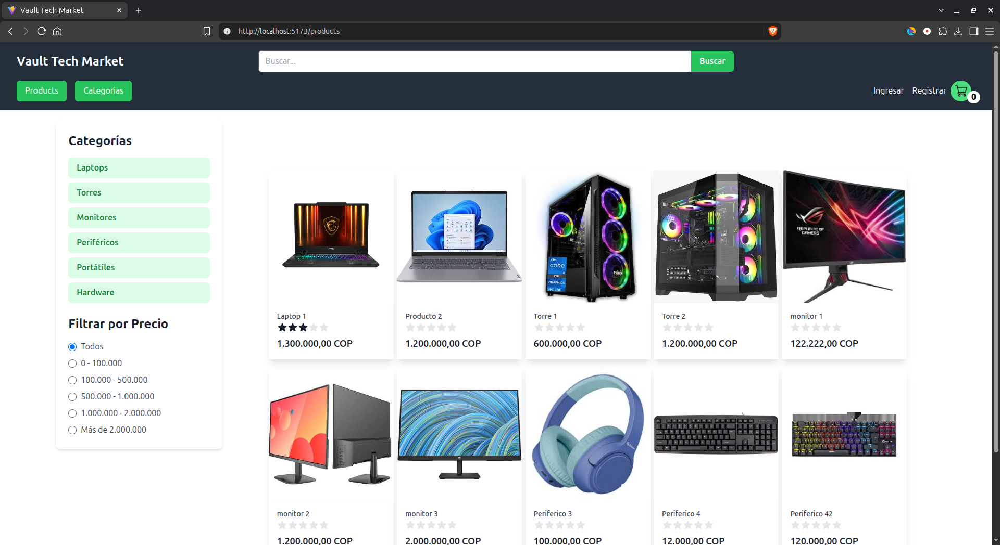
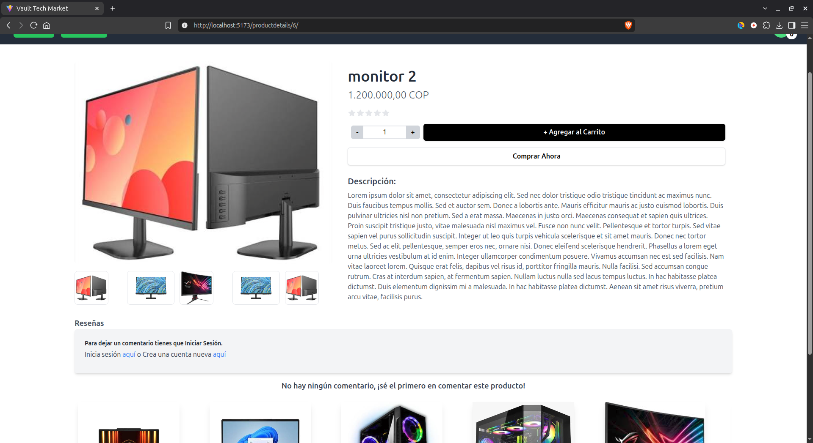
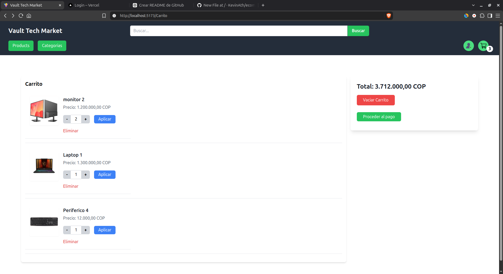

# 🛒 E-Commerce Full Stack

Aplicación web de comercio electrónico desarrollada como proyecto **Full Stack**, utilizando **React** para el frontend y **Python con Django** para el backend.

El proyecto permite visualizar y gestionar productos de una tienda virtual, incluyendo información como nombre, descripción, precio, imagen y calificación.

---

## 📸 Vista previa

### 🏠 Página principal


### 🔐 Inicio de sesión



### 🛍️ Catálogo de productos



### 📦 Detalle del producto



### 🛒 Carrito de compras



---

## 📌 Sobre el proyecto

El proyecto consiste en una aplicación de comercio electrónico que permite a los usuarios explorar un catálogo de productos y consultar la información disponible de cada uno.

La aplicación está dividida en dos partes:

* **Frontend:** desarrollado con React, encargado de la interfaz y la interacción con el usuario.
* **Backend:** desarrollado con Python y Django, encargado de la lógica de la aplicación y la gestión de los datos.

El frontend obtiene la información de los productos desde el backend y la presenta de forma dinámica en la interfaz.

---

## ✨ Funcionalidades

* 🔐 Inicio de sesión.
* 👤 Gestión de usuarios.
* 🛍️ Visualización de productos.
* 🔎 Consulta de información de productos.
* 🖼️ Imágenes de productos.
* 📝 Nombre y descripción.
* 💰 Precio de los productos.
* ⭐ Calificación de los productos.
* 🛒 Carrito de compras.
* 📦 Gestión de productos.
* 🔄 Operaciones CRUD.
* 🗄️ Gestión de información mediante base de datos.

---

## 🛠️ Tecnologías utilizadas

### Frontend

* ⚛️ **React**
* JavaScript
* HTML
* CSS

### Backend

* 🐍 **Python**
* 🌐 **Django**

### Herramientas

* Git
* GitHub

---

## 🧩 Estructura del proyecto

```text
ecommerce_fullstack/
│
├── backend/
│   ├── manage.py
│   └── ...
│
├── frontend/
│   ├── src/
│   ├── public/
│   └── ...
│
├── .gitignore
└── README.md
```

---

## ⚛️ Frontend

El frontend fue desarrollado utilizando **React**.

Se encarga de construir la interfaz de usuario y mostrar dinámicamente la información proporcionada por el backend.

Entre sus principales funciones se encuentran:

* Mostrar el catálogo de productos.
* Mostrar imágenes.
* Presentar precios y descripciones.
* Mostrar las calificaciones.
* Gestionar la interacción con los productos.
* Gestionar el carrito de compras.
* Permitir el inicio de sesión.

---

## 🐍 Backend

El backend fue desarrollado utilizando **Python y Django**.

Django se encarga de gestionar la lógica del servidor, los datos de los productos y las solicitudes realizadas por el frontend.

Entre sus responsabilidades se encuentran:

* Gestión de usuarios.
* Gestión de productos.
* Gestión de imágenes.
* Gestión de precios.
* Gestión de descripciones.
* Gestión de calificaciones.
* Gestión del carrito.
* Operaciones CRUD.
* Comunicación con la base de datos.

---

## 🗄️ Información de los productos

Cada producto contiene información que permite mostrar sus características principales dentro de la tienda:

```text
Producto
├── Nombre
├── Descripción
├── Precio
├── Imagen
└── Calificación ⭐
```

La información es gestionada desde el backend y posteriormente presentada dinámicamente mediante React.

---

## 🛒 Carrito de compras

La aplicación cuenta con un carrito de compras que permite gestionar los productos seleccionados por el usuario.

El carrito forma parte del flujo de compra y permite visualizar los productos agregados junto con la información correspondiente.

---

## 🌐 Demo

### 🔗 Aplicación

https://ecommerce-fullstack-beta.vercel.app/

### 💻 Repositorio

https://github.com/KevinAth/ecommerce_fullstack

---

## 🎯 Objetivo del proyecto

Este proyecto fue desarrollado para poner en práctica conocimientos de **desarrollo Full Stack**, integrando un frontend desarrollado con React y un backend desarrollado con Python y Django.

Durante su desarrollo se aplicaron conceptos como:

* Desarrollo de interfaces con React.
* Desarrollo backend con Django.
* Gestión de bases de datos.
* Operaciones CRUD.
* Comunicación entre frontend y backend.
* Manejo de información dinámica.
* Gestión de usuarios y productos.
* Control de versiones con Git y GitHub.

---

### GitHub

https://github.com/KevinAth
